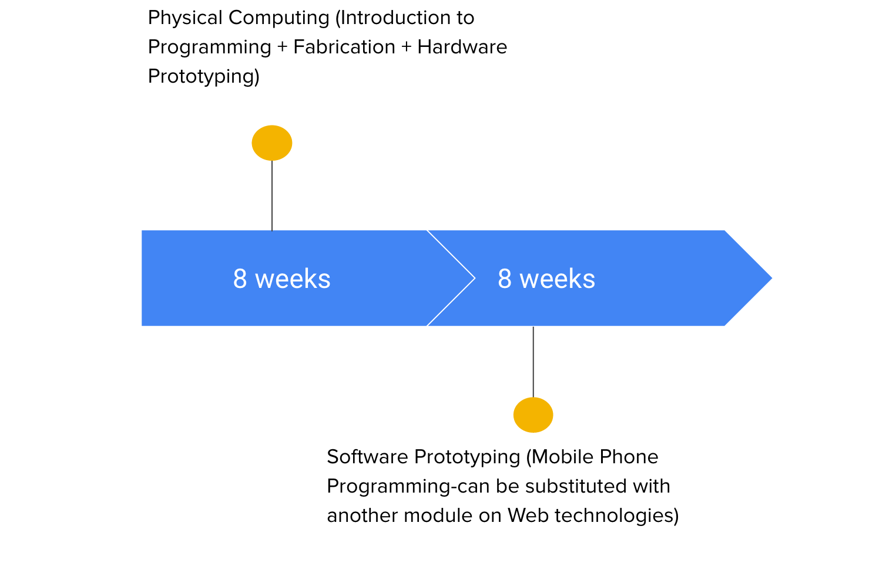
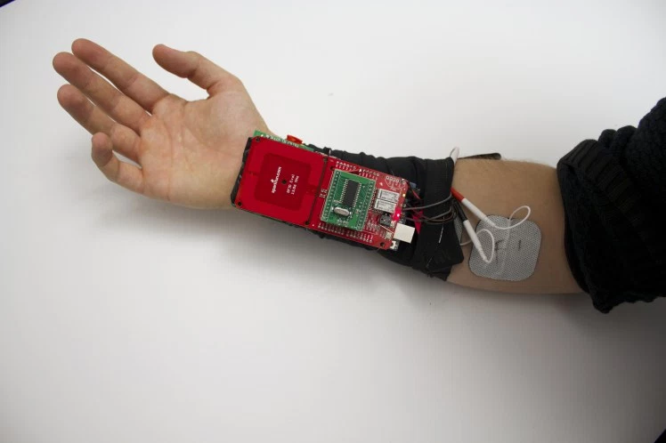
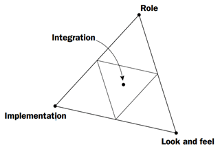
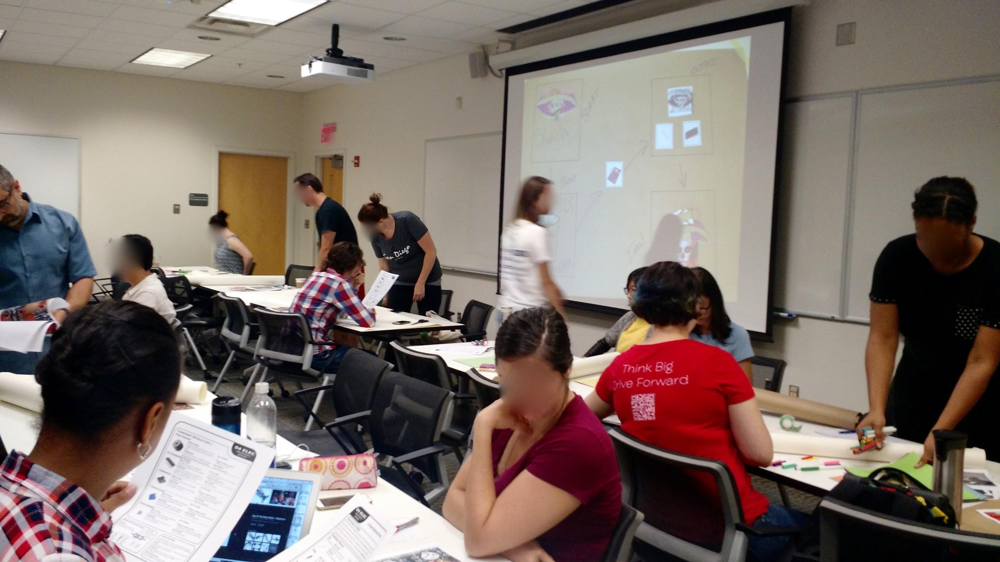
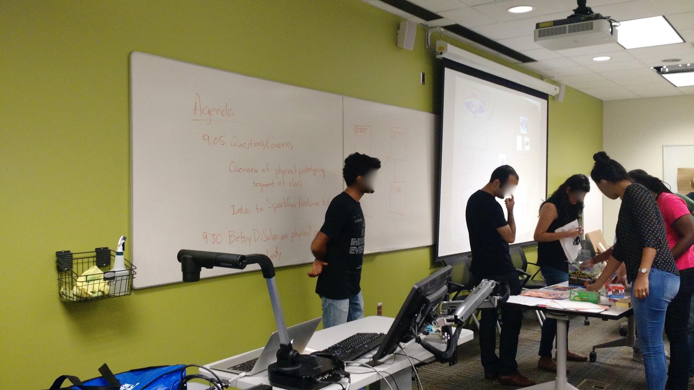
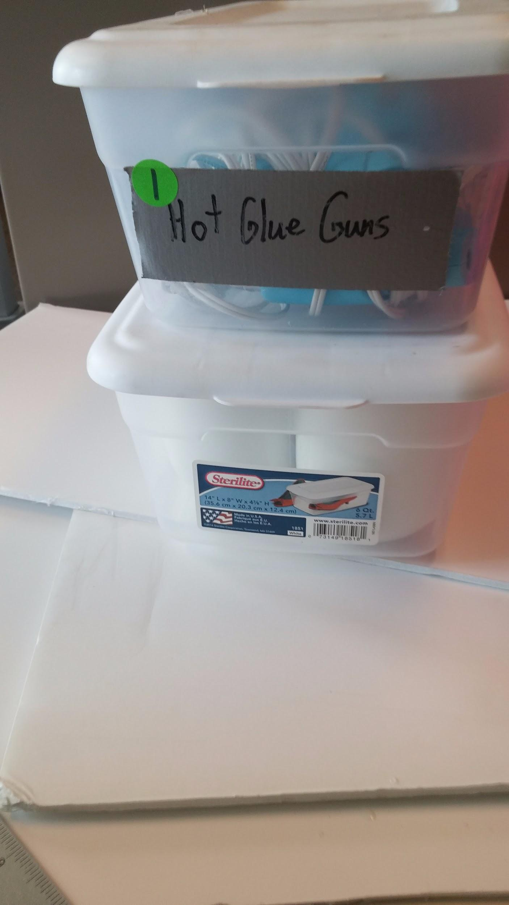

# CS-6452 Prototyping Interactive Systems(HCC-2) Syllabus

Class Goal

The goal of this course is to

> * Give students the confidence to build a variety of computational artifacts (both software and hardware)

> * Enable students to talk about their design process 

> * Demystify some technical vocabulary

Broadly speaking, this is achieved through:

> * Technical doing

> * Technical thinking

> * Technical reading

> * Technical writing

## Secondary Goal

With the technological landscape so rapidly changing, a secondary goal of this class is to 'learn how to learn.' While there is no one way to do this, we sought to develop **technical efficacy** amongst students by adopting certain strategies that are captured in the ['Class Philosophy'](https://docs.google.com/document/d/1LF5SmpCjfAb4eAkxkYvKwMXbwxLkWFatmLKEB3UIAts/edit?usp=sharing) section. Some examples are:

> * Starting from low-hanging fruit and slowly pushing students to step out of their comfort zone to scaffold their learning process

> * Working with a glass box enclosure instead of a black box enclosure where students start from an example template (code, 3D modeling file etc.) and then dive deeper into the details of the technology by customizing pieces of it

[Tom Igoe](http://www.tigoe.net/blog/) describes:

> "This is what I call 'glass box enclosure' as opposed to 'black box enclosure'... the box is still nicely packaged, but the complexity is not hidden, it's just wrapped up so you can ignore the details when you want to. You can look inside the package if you want, and learn from it."

# How do we achieve this goal (Course Overview)?

Overall, the class is divided into two conceptual chunks: physical computing and software prototyping.

# What skills will students learn in this course?

This class takes a broad approach and gives a variety of skills in prototyping both physical and digital experiences using a mix of **low-fi and hi-fi techniques**. 

By the end of this course, students will be able to build hardware and software prototypes which may be used as proof-of-concepts of novel technologies, to elicit user feedback or as research instrumentation to test a hypothesis. This is explored in some ways in the "Research through Design" reading in this course, chapter six of *Ways of Knowing in HCI*.

Physical prototyping Skills:

> * Early paper prototyping

> * Rapid foam-core model construction

> * Laser Cutting

> * 3D Printing

> * Introductory programming through Processing

> * Programming hardware using Arduino

Software Prototyping (Mobile phone) Skills:

> * Visual programming using MIT App Inventor

> * Native Android programming using Android Studio

> * Using sensors on the mobile phone such as camera, touchscreen, and accelerometer

> * Using RESTful APIs such as Parse.com for database storage and retrieval (networking + persistence)

Again, this course is not meant to make students an expert in any of the above skills (there are other advanced courses for that), but rather serves as a **leveler** by taking a hands-on approach to giving a high-level overview of a breadth of topics. 

Students can further explore these topics by either pursuing advanced courses or independently undertaking projects for a deeper understanding of a particular topic.

# Why are these skills relevant?

While the original motivation for the class was to give students competency in programmatically building prototypes themselves, it has evolved in the current. In today's world, boundaries between the physical world and digital world are evaporating, with the internet of things and wearables becoming the next generation of connectivity. As such, the scope of this class has broadened to give students a toolbox of a variety of skills in both physical and digital prototyping, to be able to create proofs of concept of the future of technology and computing. Students may transfer these skills to both their research as well as other classes on Georgia Tech's campus such as Intro to HCI (6750) and Design of Interactive Environments (6763).

It is also worth noting that these skills have a place both in research and the industry with job openings for titles such as UX Prototyper and Creative Technologist as well as major conferences such as Mobile HCI, CHI, UIST, and ISWC featuring work that combines such skills. 

Fig 1: [Transhumanist Design at CHI 2015 ](http://hplusmagazine.com/2015/04/21/transhumanist-design-at-chi-2015/)

# Who should take this course?

While this class was originally meant to be the technical counterpart to the social theory focused HCC 1 class (hence also called HCC 2), there are other classes that can help fulfill the computational portfolio requirement for HCC students.

This class in the recent past has been taken by both PhD students from HCC as well as Master's students, notably from HCI (across all tracks). We welcome students' interdisciplinary backgrounds, especially given the breadth of all skills covered in this class and its collaborative nature.

Before students take the decision to be in this class they should try and ask themselves the following questions:

> * Do they want to take the class?

> * Do they need to take the class when there may be other classes on campus to fulfill core requirement?

> * Do they have prior experience with hardware prototyping (e.g. Arduino), Processing, laser cutting, 3D printing?

# How to use this Curriculum

This document provides an overview of course goals, class philosophy, and methods used in the classroom which apply to both the Physical Computing and Software Prototyping portions of the course. In addition, we have detailed notes on how to plan individual classes for the Physical Computing portion of the course. For first-time teachers we recommend adopting the schedule and lesson plans presented in this guide as well as sticking with the technologies (e.g. Processing, Arduino) we adopted. For those who prefer to customize their lessons or go beyond the current plan, feel free to play around with the schedule, technologies, tweak our activities, or even change things altogether. You know the needs of your students best!

# What is Physical Computing?

> "We've already accepted the idea that if no one makes the software you need, you can develop it yourself. The same is true, or can be, with hardware. This is the spirit behind physical computing." --Tom Igoe

Physical computing, in the broadest sense, means building interactive physical systems by the use of software and hardware that can sense and respond to the analog world (Wikipedia). As such it combines many different skills such as electronics, design, programming, etc. 

Students don't need any prior background in electronics for this course. They will learn just enough in this class to connect a variety of sensors and actuators to a microcontroller so that they can realize their ideas.

Though students will  be introduced to programming in order to control their microcontrollers, we must qualify this by mentioning that it is a very practical approach to programming where students jump straight into the coding by customizing working pieces of code to produce an outcome. As such, we do not spend too much time in class explaining the basics of programming constructs such as if statements, for-loops etc. As such students with no prior programming experience may have to spend some time on their own or with the TA in order to get a hold on these concepts. 

Students will also learn some manual and automated techniques to give physical form to their artifacts. In this manner,  we cover both and form and function of a an interactive physical artifact.

Many of the learnings from this half can be transferred to second half of the course. For example students learn how to separate the look of an artifact from its interaction, which still holds in the context of an artifact such as a mobile app.

# What about the second half of the course?

Through the first half of this curriculum students are eased into the tinkering mindset and using resources on the Internet and within their personal network to troubleshoot hardware/software problems. We used the momentum from the first half of the curriculum and threw students into the deep end of programming with building mobile applications. The paper "No Silver Bullet" (Brooks, 1986) was a good segue, that drew parallels and differences between hardware and software development. 

A common theme that was maintained across the course was that of sensing and actuation. A contrast was that the programming that we did in the first half employed the 'loop paradigm' whereas mobile phone programming was almost entirely event-based.

If you are teaching a semester-long class, you can find materials on our mobile phone programming module on our class website: [gtprototyping 2015.pbworks.com](http://gtprototyping2015.pbworks.com/w/page/99222106/CS%206452%20Prototyping%20Interactive%20Systems).

You may also replace this part of the course with a primer on building web applications. You can still employ the model where students learn from examples and tweaking pieces of code.

# Physical Computing Modules and Milestones

The Physical Computing portion is realized over an eight-week period and leads students down a path of discovery and tinkering. It can be broken down into the following modules:

## Module 1: Intro to Programming

This module introduces students to the[ Processing IDE](https://processing.org/) which is known to have promoted software literacy within the visual arts and visual literacy within technology. In this module students will get their first flavor of "glass-box" programming where they will use existing code and tweak it to produce the result they desire. With a few lines of code students will be able to observe changes in output and be able to develop some confidence with software using this hands-on, practical approach to programming. 

This module also helps students prepare for the Arduino programming they have to do later on during the course. The Processing IDE is very similar to the Arduino IDE without the additional complexities introduced by the hardware which makes troubleshooting easier as they are only dealing with software. 

Assignments:

> * [Procure the Sparkfun Inventor Kit](https://docs.google.com/document/d/1960Mx_x8TzQ-hqMVV5HIxpBU_YJgde-XJsCktCl56Mw/edit?usp=sharing)

> * [First Processing sketch- ](https://drive.google.com/open?id=0BwLVd0W-_5qwVnZkUmpQeV85cW8)[Learning ](https://drive.google.com/open?id=0BwLVd0W-_5qwVnZkUmpQeV85cW8)[from](https://drive.google.com/open?id=0BwLVd0W-_5qwVnZkUmpQeV85cW8)[ example](https://drive.google.com/open?id=0BwLVd0W-_5qwVnZkUmpQeV85cW8)

> * [Visualizing](https://drive.google.com/open?id=0BwLVd0W-_5qwekpnaVdIaTE4NGM)[ accelerometer](https://drive.google.com/open?id=0BwLVd0W-_5qwekpnaVdIaTE4NGM)[ data from a file](https://drive.google.com/open?id=0BwLVd0W-_5qwekpnaVdIaTE4NGM)

## Module 2: Looks like model (Manual and Automated Prototyping)

Computing artifacts have both form and function eg. a personal digital assistant such as the Apple iPhone has an operating system, a hard case with various ports, a graphical user interface and audio feedback. Users experience the combined effect of such interrelated features; and to simplify the task of designing one can separate the form of the artifact from the functionality.

This module helps separate the look of an idea from its functionality without worrying about the complete final product. Students will learn to visually communicate their designs from as they move from sketches and paper prototypes to building 3D models using manual techniques such as foam-core modeling and automated techniques such as laser cutting and 3D printing. 

Assignments:

> * [Day of the dead paper prototyping informal critique (ungraded)](https://docs.google.com/document/d/1MVC-sscwIJKr6rXeRTihTBYH8YmF9tFIAWlO7v7VLwc/edit?usp=sharing)

> * Tour GT Invention Studio, GVU Prototyping Lab TSRB to learn about 3D printing and laser cutting(ungraded)

> * [Create your own watch strap 3D model](https://drive.google.com/open?id=0BwLVd0W-_5qwcHhYaTVZNzlwMVk)

> * [Make your own Name badge and name badge stand](https://drive.google.com/open?id=0BwLVd0W-_5qwWXpsb1JGUWZ4cmM) + [in class critique](https://docs.google.com/document/d/1u3Hr14VmoMFUwvfS_WgxySIO1q0ebxWZAkdHtp82mAw/edit?usp=sharing)

## Module 3: Works like Model (Introduction to Arduino, Arduino Meets Processing)

This module will introduce students to the Arduino, an open source hardware prototyping platform. Arduino will provide a platform for students to interface with the physical world directly through **sensors**, which read the state of the world, and **actuators**, which change the state of the world.

Processing has a variety of libraries written for it that students will be able to make use of to augment the capabilities of the Arduino environment, for example using data storage on the computer and producing multimedia output such as audio or video.

Assignments:

> * [Arduino ](https://drive.google.com/open?id=0BwLVd0W-_5qwa0pQeDM1N2hjOFU)[introductory](https://drive.google.com/open?id=0BwLVd0W-_5qwa0pQeDM1N2hjOFU)[ sketches](https://drive.google.com/open?id=0BwLVd0W-_5qwa0pQeDM1N2hjOFU) +[ in class assessment ](https://docs.google.com/document/d/1SdBdDOWJnCjguOG5jsKkO0cmiCS0ketbRtjfWV8CHTQ/edit?usp=sharing)

> * [Arduino meets Processing](https://drive.google.com/open?id=0BwLVd0W-_5qwcExwWUZUMjVZaUk)[-](https://drive.google.com/open?id=0BwLVd0W-_5qwcExwWUZUMjVZaUk)[Visualizing live sensor data](https://drive.google.com/open?id=0BwLVd0W-_5qwcExwWUZUMjVZaUk)

## Module 4: Integrating 'works like' and 'looks like' modules

Students will combine learnings from the previous modules and design an integrated (looks like + works like) prototype for their artifact. 

It is important to understand that while this phase is called the 'Integration' stage, students have varying degrees of success with integrating the form and function of the prototypes. Some may produce artifacts that are high-fidelity with respect to form but not very close to capturing the functionality and vice versa. The Houde and Hill model (1996) of 'What do Prototypes Prototype?' can help us think about these final-projects in similar vein(fig. 2 ).
 

Fig. 2: Model for mapping student's final project artifacts

## [Final Project](https://drive.google.com/open?id=0BwLVd0W-_5qwVnRocWpKdlJUbjA)

Make an interactive art exhibit that combines Arduino (Processing optional) and Manual and Automated Prototyping skills learned during this class.

# Style of Classes

> * Some/most of classes will have a studio model to them 

> * Review of a reading or a quick idea 

> * In-class, hands-on activity (individual or small group)

> * Reflection l Critiques, particularly of bigger projects

# A typical day in class

Each of the modules discussed above are taught over a period of eight weeks in the form of **three-hour classes**.  The classes employ a hands-on approach, and most classes can be abstracted to the following chunks, though not necessarily in the same order nor containing all components:

## Lecture 

These are delivered by the instructor to the class and introduce an idea relevant to the topic for the day.

## Reading Discussion (Talk)

To fulfill the Technical Reading Criteria of this course, students will read research papers and write reflections on them to facilitate discussion of the ideas presented in the reading in the class. The role of the instructor here is that of a facilitator to encourage 'active' discussion from students in class.

## In-Class Activity (Do)

This is the 'hands-on' component of a class and is meant to introduce students to different skills in the class. These in-class activities are usually simple and meant to scaffold larger out-of-class assignments. In-class activities facilitate quick troubleshooting by not only the instructor and TA but also by peers before students get dirty with tinkering.
An in-class activity typically contains the following-

> Overview of what is going to be done and why it is important

> Demonstration of a technique by the instructor/TA

> Steps for the activity

Successive in-class activities may build-off on each other where the first activity works as a warmup to set the stage for the following activity.

In-Class activities are often followed by Debriefs, although in many cases it's hard to separate the Debrief from the Activity as they occur in parallel.

## Debrief (Reflect)

Since this class employs the Learning by Doing philosophy it is important to reflect on what one has learned after having performed an activity.

According to the Stanford d.School's methods, debriefing an activity or experience is a powerful tool for getting feedback from students about how they liked the activity and what they learned. It's also powerful for students to have the opportunity to unpack their experience, sort through their emotions, and feel heard among their peers. 

This may also be a follow-up on an out-of-class assignment or an activity from previous class.

## Out-of-Class Assignments

These are larger, more complex hands-on tasks that students perform to gain comfort and deepen understanding with a particular skill. While students are encouraged to seek help from peers or the instructor, these assignments offer an opportunity to the student to make mistakes and learn by trial and error. These also allow students to seek resources outside of the classroom (such as communities on the Internet) for help with troubleshooting. All out-of-class assignments were **individual** (at least in the first half) though students were encouraged to seek help from each other.

## Critiques (Assess)

Collective assessment of an idea/artifact/project that was conducted by the class as a whole. To facilitate constructive feedback we followed a protocol where students would gather around the artifact being assessed and 

> 1. First, say something nice about the artifact/process

> 2. Ask questions about what was unclear, missing or suggest improvements

# Before you begin: a checklist

## Community of Support

This class is not a one person job (especially not for a new teachers) and so we used a number of resources on Georgia Tech's Campus, from the web etc. to make this class work.

### [Georgia Tech Maker Spaces](https://docs.google.com/document/d/1PtOArrPoZziFEAyyo_15a48qZEg93aB7p6d7bjA3F8o/edit?usp=sharing)

### [Resources on the Web](https://docs.google.com/document/d/1BABti6BhoXAQx57dr4UE0L6OymsZBpETL4GwDttLqB0/edit?usp=sharing)

### People on GT campus

#### Instructional Team

The following people were directly involved with the curriculum planning of the class

	Gregory Abowd

	Betsy DiSalvo

> Aman Parnami

> Zane Cochran

#### Past Students

We have students who have taken the class in Fall 2015 who can act as TA's for the class or guest lecturers

Current Students	

In addition, we made capitalized on the diverse pool of skill set in class by offering extra-credit to those students who were willing to conduct a module in class.

## Physical Classroom Space

The space played a huge role in shaping a collaborative environment in the class, as well as in being conducive to the activities we conducted in class. We had the following setup available in the class:

> * Plenty of whiteboards around the classroom

> * Audio playback for showing videos in class

> * Document camera to show the 'making' process for some lessons

> * HDMI/VGA connectors for students to connect during presentations

> * Plenty of plug points for students to connect laptops every class

> * Movable furniture

> * Projector and screen in the front and back of the class, so students could be made to sit facing each other during activities (fig. 2) 

Fig. 3: Students sit on both sides of tables, with front and back projectors available

Fig. 4: Desk rearranged so materials can be placed in front of the classroom

We used room #1214 of the [U.A. Whitaker Biomedical Engineering](https://www.bme.gatech.edu/bme/directions-bme-gt) building to conduct our class during Fall 2015.

## Furniture

Movable desks and chairs in the class helped not only movement of students during activities, but also being able to layout the class for affording different kinds of activities. For example, during presentations we would have tables lined up along the walls, with chairs cleared out, so students could place their demos on the tables. 

This flexibility also allowed us to place tools and materials for in-class activities in a central spot so everyone had access to them. (fig. 4)

White boards were affixed to the walls along the perimeter of the classroom and enabled students to put up any poster/visual aid.

We would have liked to have some form of storage in the classroom for safekeeping of artifacts made by students or for storing tools (such as Arduino kits) that we loaned out for the class. We found a workaround by making use of a foldable utility [cart](http://www.walmart.com/ip/Seville-Classics-Folding-Utility-Cart-Black/24949772) (available for around $25 at Walmart) and baskets for transportation of materials(fig. 6).

Fig. 6: Materials organized in boxes and trays and transported using cart

## Grading

> * Class Participation 20%

>     * Showing up for class, being involved in class discussion, participating in studio/practicum activities 

>     * Presentations in class

> * Individual Assignments 30%

>     * About 5 this semester

>     * Working and understandable code that demonstrates concepts of assignment 

> * Reading Reviews 10%

>     * One page summaries of required readings. 

> * Projects (Individual/Group) 40%

>     * First project is individual, second is in teams

>     * Meeting programming requirements, demonstrating creativity

>     * Presentation in class and participation in critiquing 

# [Week by Week outline](https://drive.google.com/file/d/0BwLVd0W-_5qwdFplNERLYXlkTWc/view?usp=sharing)

# 
Miscellaneous

Administrative stuff:

> * Pbworks workspace for maintaining Calendar, Wiki style, easy to setup without code

> * TA's

> * All students need laptop every class

> * No textbook for course, may have to buy Arduino Kit and Parts

> * [Procuring an Sparkfun Inventor's Kit](https://docs.google.com/document/d/1960Mx_x8TzQ-hqMVV5HIxpBU_YJgde-XJsCktCl56Mw/edit?usp=sharing)

> * [Installing Arduino IDE](https://docs.google.com/document/d/1CsgLqh0aOaqNOjipeSZvMLlwJvh2weyohmtF3F6FnLI/edit?usp=sharing)

# Previous Offerings of the Class

## [Fall 2014](http://gtprototyping2014.pbworks.com/w/page/84193882/CS%206452%20Prototyping%20Interactive%20Systems)

## [Fall 2015](http://gtprototyping2015.pbworks.com/w/page/99222106/CS%206452%20Prototyping%20Interactive%20Systems)

## [Mobile and Ubiquitous Computing Spring 2015 ](http://gtubicomp2015.pbworks.com/w/page/90258548/CS%204605%20Mobile%20and%20Ubiquitous%20Computing)(another class in similar vein)

# Reference

Houde, S., & Hill, C. (1997). What do prototypes prototype. Handbook of human-computer interaction, 2, 367-381.

